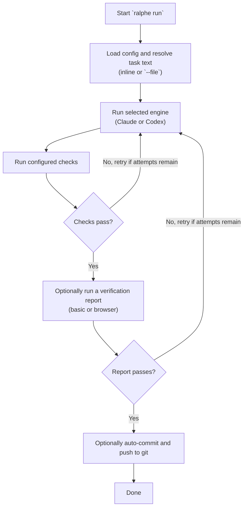

# ralphe

Effect TS AI coding agent task runner. Runs AI agents (Claude Code, Codex) against tasks, verifies output with shell commands, and retries with error feedback on failure.

## Install

```bash
cd apps/ralphe && bun run link
```

This registers the `ralphe` CLI globally via symlink.

## Global Skill

```bash
ralphe skill
```

This installs the bundled `ralphe` skill into the global Claude and Codex skill directories. Running it again replaces the existing global `ralphe` skill with the version bundled in the CLI, so it works cleanly with `bunx`.

## Usage

```bash
# Text task
ralphe run "fix the failing tests"

# File task (e.g. a PRD)
ralphe run --file PRD.md
ralphe run -f tasks.txt

# Override engine
ralphe run --engine codex "add input validation"

# Install or refresh the global ralphe skill
ralphe skill
```

## Config

Run `ralphe config` to interactively configure per-project settings. This creates `.ralphe/config.json` in the current directory.

```bash
ralphe config
```

The wizard auto-detects your project type (Node/Python/Go/Rust) and lets you select from suggested check commands.

```json
{
  "engine": "claude",
  "maxAttempts": 2,
  "checks": [
    "bun run typecheck",
    "bun run lint",
    "bun test"
  ],
  "autoCommit": false,
  "report": "none"
}
```

| Field | Default | Description |
|-------|---------|-------------|
| `engine` | `"claude"` | AI engine (`"claude"` or `"codex"`) |
| `maxAttempts` | `2` | Max retry attempts on check failure |
| `checks` | `[]` | Shell commands to verify agent output |
| `autoCommit` | `false` | Auto-commit and push on success |
| `report` | `"none"` | Verification report mode (`"none"`, `"basic"`, or `"browser"`) |

Without a config, ralphe runs the agent with no checks.

## How It Works



When `autoCommit` is enabled, ralphe uses the engine to generate a conventional commit message from the staged diff, then commits and pushes.

## Report

When `report` is set to `"basic"` or `"browser"`, a verification agent runs after checks pass to confirm the feature actually works (not just that it doesn't break anything).

- **`"basic"`** — verifies via terminal commands
- **`"browser"`** — can use agent-browser for visual verification (video recording)

The agent decides what verification is appropriate based on the task. Reports are saved to `.ralphe/reports/`. If verification fails, it feeds back into the retry loop like any other check failure.

## Engines

- **Claude Code** (default) — uses `@anthropic-ai/claude-agent-sdk`
- **Codex** — uses `codex exec --full-auto --json` CLI

## Errors

- `CheckFailure` — retryable (check command failed)
- `FatalError` — abort (CLI not found, auth error, max retries exceeded)
