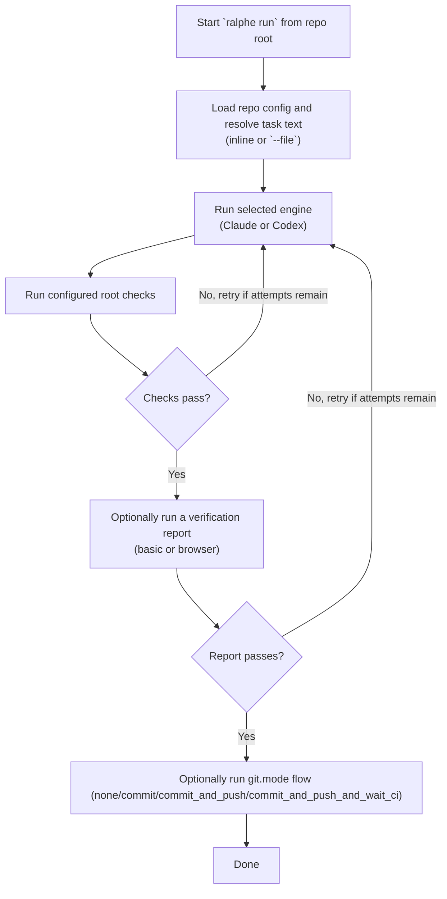

# ralphe

Effect TS AI coding agent task runner. Runs AI agents (Claude Code, Codex) against tasks, verifies output with shell commands, and retries with error feedback on failure.

## Install

```bash
cd apps/ralphe && bun run link
```

This registers the `ralphe` CLI globally via symlink.

## Global Skill

```bash
ralphe skill
```

This installs the bundled `ralphe` skill into the global Claude and Codex skill directories. Running it again replaces the existing global `ralphe` skill with the version bundled in the CLI, so it works cleanly with `bunx`.

## Usage

```bash
# Run from the repository root

# Text task
ralphe run "fix the failing tests"

# File task (e.g. a PRD)
ralphe run --file PRD.md
ralphe run -f tasks.txt

# Override engine
ralphe run --engine codex "add input validation"

# Install or refresh the global ralphe skill
ralphe skill

# Start watch mode (TUI, default)
ralphe watch

# Headless mode (no TUI)
ralphe watch --headless

# Override engine and poll interval (seconds)
ralphe watch --engine codex --interval 30
```

## Config

Run `ralphe config` from the repository root to configure repo-level settings for a TypeScript/Node project. This creates `.ralphe/config.json` in the repository root.

```bash
ralphe config
```

The wizard reads the root `package.json` and lets you select from the root-level scripts it finds there. In a monorepo, this means `ralphe` verifies changes using the same root commands you already trust for repo-wide health, such as Turbo-powered `lint`, `typecheck`, and `test`.

```json
{
  "engine": "claude",
  "maxAttempts": 2,
  "checks": [
    "bun run typecheck",
    "bun run lint",
    "bun test"
  ],
  "git": {
    "mode": "none"
  },
  "report": "none"
}
```

| Field | Default | Description |
|-------|---------|-------------|
| `engine` | `"claude"` | AI engine (`"claude"` or `"codex"`) |
| `maxAttempts` | `2` | Max retry attempts on check failure |
| `checks` | `[]` | Shell commands to verify agent output |
| `git.mode` | `"none"` | Git behavior after success (`"none"`, `"commit"`, `"commit_and_push"`, `"commit_and_push_and_wait_ci"`) |
| `report` | `"none"` | Verification report mode (`"none"`, `"basic"`, or `"browser"`) |

Without a config, or when no root scripts are selected, ralphe runs the agent with no verification checks.

`ralphe` only auto-detects TypeScript/Node-style roots with a `package.json`. Other stacks are only supported indirectly when the repo root exposes verification through Node package scripts such as `turbo test` or `turbo lint`.

## Beads Watch Mode

`ralphe watch` now defaults to TUI mode with an in-process single worker. Use `--headless` for log-only execution.

```bash
# TUI mode (default)
ralphe watch

# Headless mode
ralphe watch --headless
```

Critical usage notes:

- Run from repository root so `.ralphe/config.json` and `.beads/` resolve correctly.
- Watch mode executes only `bd ready` tasks (not every `open` task).
- Only one task runs at a time.
- Metadata is written under `metadata.ralphe` (engine, resume token, worker ID, timestamp).

### Watch TUI Status Mapping

The watch TUI derives a `Ralphe status` from the raw Beads task state. The detail view should show the Ralphe status. In the dashboard model, labels are only used where they add meaning beyond the status itself.

| Ralphe status | Beads status | Label | Notes |
|-------|---------|-------------|-------------|
| `backlog` | `open` |  | Open task that is not currently ready. |
| `actionable` | `open` | `ready` | Open task that is ready to run and has no unresolved blocking dependencies. |
| `blocked` | `open` |  | Open task with unresolved blocking dependencies. |
| `active` | `in_progress` |  | Task currently being worked. |
| `done` | `closed` |  | Task closed successfully. |
| `error` | `open` | `error` | Open task that failed and should remain visible as an error instead of finalizing to `closed`. |

Notes:

- `Ralphe status` is the TUI-friendly status that `ralphe` computes for display.
- `Beads status` is the raw task status from `bd`.
- `backlog`, `actionable`, `blocked`, and `error` all come from Beads `open`; the difference is whether the task is ready, blocked by dependencies, or marked with an error.
- The detail view should show the Ralphe status (`backlog`, `actionable`, `blocked`, `active`, `done`, `error`).
- `ready` is the label that distinguishes actionable work from backlog work.
- `blocked` is a status, not a label.
- `error` is the failure label for work that remains open.
- Exhausted failures use `markTaskExhaustedFailure` in [`beads.ts`](src/beads.ts): task stays open, `ready` label is removed, `error` label is applied, and the failure reason is preserved in metadata and notes.

TUI keys:

- `q`: quit (current in-flight task is allowed to finish)
- `r`: refresh task list
- `j` / `k`: move selection
- `Enter`: open task details

Resume tokens (Claude `session_id` / Codex `thread_id`) are persisted in Beads metadata to support manual interactive resume:

```bash
claude --resume <session_id>
codex resume <thread_id>
```

## How It Works



When `git.mode` is `commit`, `commit_and_push`, or `commit_and_push_and_wait_ci`, ralphe uses the engine to generate a conventional commit message from the staged diff, then commits. In `commit_and_push`, it also pushes. In `commit_and_push_and_wait_ci`, it pushes and waits for the GitHub Actions run for `HEAD` to finish successfully.

## Monorepos

For the first-pass monorepo workflow, `ralphe` assumes you run it from the repository root.

- Config is stored once at the repo root in `.ralphe/config.json`
- Verification uses only root-level scripts from the root `package.json`
- Nested app/package scripts are not auto-discovered during configuration

This keeps verification aligned with repo-wide commands, so changes in shared packages can still surface breakages in downstream apps.

## Report

When `report` is set to `"basic"` or `"browser"`, a verification agent runs after checks pass to confirm the feature actually works (not just that it doesn't break anything).

- **`"basic"`** — verifies via terminal commands
- **`"browser"`** — can use agent-browser for visual verification (video recording)

The agent decides what verification is appropriate based on the task. Reports are saved to `.ralphe/reports/`. If verification fails, it feeds back into the retry loop like any other check failure.

## Engines

- **Claude Code** (default) — uses `@anthropic-ai/claude-agent-sdk`
- **Codex** — uses `codex exec --full-auto --json` CLI

## Errors

- `CheckFailure` — retryable (check command failed)
- `FatalError` — abort (CLI not found, auth error, max retries exceeded)
