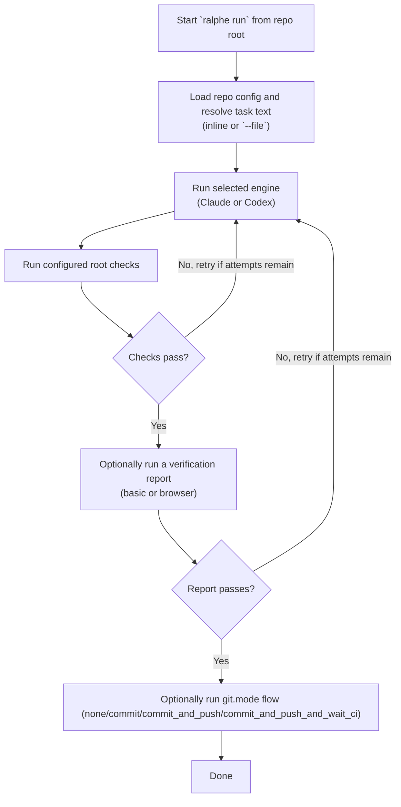

# ralphe

Effect TS AI coding agent task runner. Runs AI agents (Claude Code, Codex) against tasks, verifies output with shell commands, and retries with error feedback on failure.

## Install

```bash
cd apps/ralphe && bun run link
```

This registers the `ralphe` CLI globally via symlink.

## Global Skill

```bash
ralphe skill
```

This installs the bundled `ralphe` skill into the global Claude and Codex skill directories. Running it again replaces the existing global `ralphe` skill with the version bundled in the CLI, so it works cleanly with `bunx`.

## Usage

```bash
# Run from the repository root

# Text task
ralphe run "fix the failing tests"

# File task (e.g. a PRD)
ralphe run --file PRD.md
ralphe run -f tasks.txt

# Override engine
ralphe run --engine codex "add input validation"

# Install or refresh the global ralphe skill
ralphe skill

# Start watch mode (TUI, default)
ralphe watch

# Headless mode (no TUI)
ralphe watch --headless

# Override poll interval (seconds)
ralphe watch --interval 30
```

## Config

Run `ralphe config` from the repository root to configure repo-level settings for a TypeScript/Node project. This creates `.ralphe/config.json` in the repository root.

```bash
ralphe config
```

The wizard reads the root `package.json` and shows **all** root-level scripts as selectable check options. In a monorepo, this means `ralphe` verifies changes using the same root commands you already trust for repo-wide health, such as Turbo-powered `lint`, `typecheck`, and `test`.

Verification-oriented scripts (`typecheck`, `lint`, `test`) are enabled by default. All other root scripts are visible in the wizard but disabled by default, so you opt in explicitly. Nested workspace or package-level scripts are not discovered — only the root `package.json` is used.

```json
{
  "engine": "claude",
  "maxAttempts": 2,
  "checks": [
    "bun run typecheck",
    "bun run lint",
    "bun test"
  ],
  "git": {
    "mode": "none"
  },
  "report": "none"
}
```

| Field | Default | Description |
|-------|---------|-------------|
| `engine` | `"claude"` | AI engine (`"claude"` or `"codex"`) |
| `maxAttempts` | `2` | Max retry attempts on check failure |
| `checks` | `[]` | Shell commands to verify agent output |
| `git.mode` | `"none"` | Git behavior after success (`"none"`, `"commit"`, `"commit_and_push"`, `"commit_and_push_and_wait_ci"`) |
| `report` | `"none"` | Verification report mode (`"none"`, `"basic"`, or `"browser"`) |

Without a config, or when no root scripts are selected, ralphe runs the agent with no verification checks.

`ralphe` only auto-detects TypeScript/Node-style roots with a `package.json`. Other stacks are only supported indirectly when the repo root exposes verification through Node package scripts such as `turbo test` or `turbo lint`.

## Epic / Task Model

`ralphe` uses a strict two-level hierarchy for organizing work:

```
Epic (Beads issue labeled "epic")
├── Properties: id, title, branch (canonical), body (PRD)
├── Worktree: .ralphe-worktrees/{sanitized_epic_id}
└── Tasks (child Beads issues with parentId → epic)
    ├── Task 1: Runs in epic's worktree on epic's branch
    ├── Task 2: Reuses the same worktree
    └── Task N: All execute in isolated epic context
```

### Key rules

- **Epic** = the planning, isolation, and workspace primitive. Non-runnable.
- **Task** = the runnable child unit under one epic.
- Every runnable task must belong to exactly one epic via the Beads parent relationship.
- Standalone tasks (no `parentId`) are invalid execution inputs and will be marked as errors.
- Each epic owns exactly one canonical branch and one canonical worktree.
- Tasks do not create their own branches or worktrees — they execute inside the parent epic's context.

### Epic as the PRD container

The epic issue body holds the full PRD text. When a task executes, the executor loads:
1. The child task content (title, description, design, acceptance criteria, notes)
2. The full parent epic body (prepended as a preamble to the task prompt)
3. Required epic metadata (branch, labels)

### Worktree lifecycle

- **Lazy creation** — the epic worktree is created when the first child task executes, not when the epic is created.
- **Reuse** — subsequent tasks under the same epic reuse the same worktree.
- **Recreation** — if a worktree is missing (e.g. manually deleted), it is recreated from the epic's canonical branch.
- **Branch mismatch** — if the worktree is on the wrong branch, it is force-recreated.
- **Deterministic paths** — worktree paths are derived from epic identity under `.ralphe-worktrees/` (not configurable).

### Epic closure and cleanup

- Closing an epic triggers automatic worktree cleanup (no confirmation required).
- If the worktree is dirty, cleanup still proceeds but a warning is emitted.
- After cleanup completes, the epic disappears from the watch TUI.

### Invalid epic context

If a task's parent epic is missing or incomplete, the task is marked as an error with a clear reason:

| Condition | Error |
|-----------|-------|
| No `parentId` | "Task has no parent epic. Standalone tasks are not valid execution inputs." |
| Parent not found | "Parent issue could not be loaded." |
| Parent lacks `epic` label | "Parent issue does not have the `epic` label." |
| Empty PRD body | "Epic has no PRD body." |
| No canonical branch | "Epic has no canonical branch in its metadata." |

The executor never falls back to repo-default behavior. Invalid context produces explicit task failures.

## Beads Watch Mode

`ralphe watch` defaults to TUI mode with an in-process single worker. Use `--headless` for log-only execution.

```bash
# TUI mode (default)
ralphe watch

# Headless mode
ralphe watch --headless
```

The TUI header displays a condensed config summary showing the active engine, max attempts, checks count, git mode, and report mode.

Critical usage notes:

- Run from repository root so `.ralphe/config.json` and `.beads/` resolve correctly.
- Watch mode executes only `bd ready` tasks (not every `open` task).
- Only one task runs at a time globally (epic isolation is about workspace state, not parallel execution).
- Metadata is written under `metadata.ralphe` (engine, resume token, worker ID, timestamp).
- **Stale task recovery** — on startup, any tasks left in `in_progress` from a previous session are reclaimed and retried automatically.
- **Session comment logging** — after each agent execution, the session ID is logged as a comment on the task for traceability.
- **Retry error feedback** — when a task is retried, the previous error output is included in the agent prompt so the engine can avoid repeating the same mistake.
- **Structured CI failure annotations** — when `git.mode` is `commit_and_push_and_wait_ci`, CI failure annotations are returned as structured feedback for the retry loop.

### Split Watch TUI

The TUI uses a split model with two operational surfaces:

```
┌────────────────────────────────────────┐
│ Active Tasks (primary) │ Done Tasks    │
│                        │ (secondary)   │
├────────────────────────────────────────┤
│ Epic Pane (secondary, focusable)       │
│ Shows: ID, Title, Status               │
└────────────────────────────────────────┘
```

- **Task pane** — the primary operational surface. Shows all tasks globally.
- **Epic pane** — secondary but focusable. Shows operational epic information including derived status.

### Epic display statuses

Epic status is a single derived display status, not a collection of badges:

| Status | Meaning |
|--------|---------|
| `not_started` | No epic worktree exists yet (lazy creation pending). |
| `active` | Worktree exists and is clean. |
| `dirty` | Worktree exists and has uncommitted changes. |
| `queued_for_deletion` | Operator marked the epic for deletion/cleanup. |

The TUI shows all open epics and closed epics that are queued for deletion. Epics disappear after cleanup completes.

### TUI keys

- `q` / `Escape` / `Ctrl+Q`: quit (current in-flight task is allowed to finish)
- `r`: refresh task list
- `j` / `k` / `↑` / `↓`: move selection
- `Tab`: switch between panes (active tasks, done tasks, epic pane)
- `m`: mark task as ready (task pane only — backlog, blocked, and error tasks)
- `d`: delete epic (epic pane only — queues epic for closure and worktree cleanup)
- `Enter`: open task details
- `Backspace`: back from detail view

Task-ready (`m`) and epic-delete (`d`) are distinct keys. The TUI does not overload one key across both operations.

### Mark Ready

Press `m` in the TUI to mark a task as ready for execution. Only tasks in `backlog`, `blocked`, or `error` status are eligible. Marking a task ready adds it to a non-blocking FIFO queue so the worker picks it up in order without interrupting the current task.

### Detail View

Press `Enter` on any task to open the detail view. Sections displayed (when present):

- Metadata (Ralphe status, engine, attempt count, worker ID, timestamps)
- Error details (failure reason, check output)
- Activity log with comments
- Description
- Design
- Acceptance criteria (with checkbox rendering)
- Notes
- Dependencies
- Close reason
- Timestamps (created, updated, closed)

Press `Backspace` to return to the task list from the detail view.

### Task Status Mapping

The watch TUI derives a `Ralphe status` from the raw Beads task state. The detail view shows the Ralphe status. In the dashboard model, labels are only used where they add meaning beyond the status itself.

| Ralphe status | Beads status | Label | Notes |
|-------|---------|-------------|-------------|
| `backlog` | `open` |  | Open task that is not currently ready. |
| `queued` | `open` | `ready` | Open task that is ready to run and has no unresolved blocking dependencies. |
| `blocked` | `open` |  | Open task with unresolved blocking dependencies. |
| `active` | `in_progress` |  | Task currently being worked. |
| `done` | `closed` |  | Task closed successfully. |
| `error` | `open` | `error` | Open task that failed and should remain visible as an error instead of finalizing to `closed`. |

Notes:

- `Ralphe status` is the TUI-friendly status that `ralphe` computes for display.
- `Beads status` is the raw task status from `bd`.
- `backlog`, `queued`, `blocked`, and `error` all come from Beads `open`; the difference is whether the task is ready, blocked by dependencies, or marked with an error.
- The detail view shows the Ralphe status (`backlog`, `queued`, `blocked`, `active`, `done`, `error`).
- `ready` is the label that distinguishes queued work from backlog work.
- `blocked` is a status, not a label.
- `error` is the failure label for work that remains open.
- Exhausted failures use `markTaskExhaustedFailure` in [`beads.ts`](src/beads.ts): task stays open, `ready` label is removed, `error` label is applied, and the failure reason is preserved in metadata and notes.

Resume tokens (Claude `session_id` / Codex `thread_id`) are persisted in Beads metadata to support manual interactive resume:

```bash
claude --resume <session_id>
codex resume <thread_id>
```

## How It Works



When `git.mode` is `commit`, `commit_and_push`, or `commit_and_push_and_wait_ci`, ralphe uses the engine to generate a conventional commit message from the staged diff, then commits. In `commit_and_push`, it also pushes. In `commit_and_push_and_wait_ci`, it pushes and waits for the GitHub Actions run for `HEAD` to finish successfully.

## Monorepos

For the first-pass monorepo workflow, `ralphe` assumes you run it from the repository root.

- Config is stored once at the repo root in `.ralphe/config.json`
- Verification uses only root-level scripts from the root `package.json`
- Nested app/package scripts are not auto-discovered during configuration

This keeps verification aligned with repo-wide commands, so changes in shared packages can still surface breakages in downstream apps.

## Report

When `report` is set to `"basic"` or `"browser"`, a verification agent runs after checks pass to confirm the feature actually works (not just that it doesn't break anything).

- **`"basic"`** — verifies via terminal commands
- **`"browser"`** — can use agent-browser for visual verification (video recording)

The agent decides what verification is appropriate based on the task. Reports are saved to `.ralphe/reports/`. If verification fails, it feeds back into the retry loop like any other check failure.

## Engines

- **Claude Code** (default) — uses `@anthropic-ai/claude-agent-sdk`
- **Codex** — uses `codex exec --full-auto --json` CLI

## Errors

- `CheckFailure` — retryable (check command failed)
- `FatalError` — abort (CLI not found, auth error, max retries exceeded)
